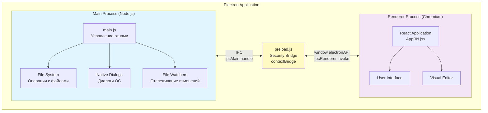
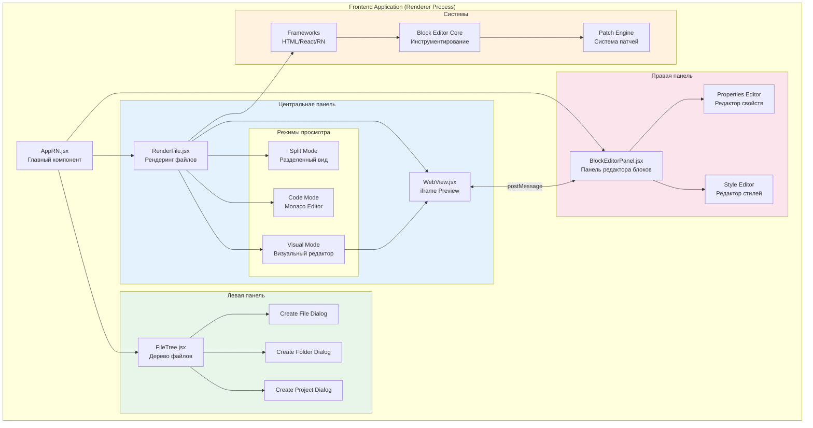
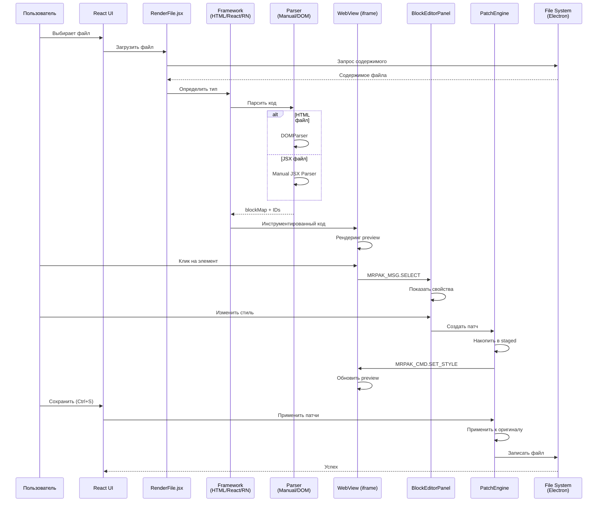
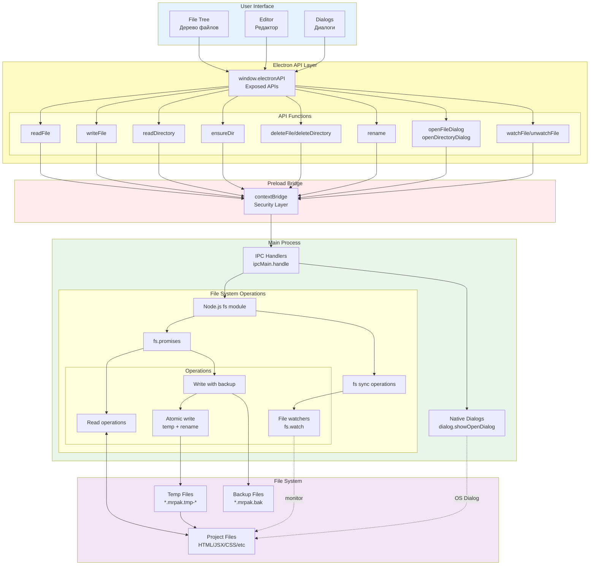

# 🏗️ Архитектура No-code UI

Комплексные диаграммы архитектуры проекта Frontend Constructor (No-code UI).

---

## 📋 Содержание

1. [Общая архитектура Electron](#1-общая-архитектура-electron)
2. [Компоненты Frontend](#2-компоненты-frontend)
3. [Поток данных при редактировании файла](#3-поток-данных-при-редактировании-файла)
4. [Система парсинга и патчей](#4-система-парсинга-и-патчей)
5. [Взаимодействие с файловой системой](#5-взаимодействие-с-файловой-системой)
6. [Протокол MRPAK (Editor Protocol)](#6-протокол-mrpak-editor-protocol)

---

## 1. Общая архитектура Electron

### Описание:
- **Main Process** - Backend на Node.js, работает с файловой системой
- **Renderer Process** - Frontend на React, пользовательский интерфейс
- **Preload Script** - Безопасный мост между процессами через contextBridge

---

## 2. Компоненты Frontend

### Основные компоненты:
- **FileTree** - Навигация по файлам проекта
- **RenderFile** - Отображение и редактирование файла
- **BlockEditorPanel** - Управление блоками/компонентами
- **WebView** - Превью с изолированным iframe

---

## 3. Поток данных при редактировании файла

### Ключевые этапы:
1. **Загрузка** - Чтение файла из FS
2. **Парсинг** - Создание blockMap
3. **Инструментирование** - Добавление ID
4. **Рендеринг** - Превью в iframe
5. **Редактирование** - Накопление патчей
6. **Сохранение** - Применение к оригиналу

---

## 4. Система парсинга и патчей

```mermaid
graph LR
    subgraph Input["Входные данные"]
        OriginalCode[Оригинальный код<br/>App.jsx]
    end
    
    subgraph ParsingStage["Этап парсинга"]
        FileReader[File Reader<br/>UTF-8]
        
        subgraph ParserChoice["Выбор парсера"]
            HTMLParser[HTML Parser<br/>DOMParser API]
            JSXParser[JSX Parser<br/>Manual Character-by-Character]
        end
        
        Instrumenter[Instrumenter<br/>Add data-no-code-ui-id]
        BlockMapBuilder[BlockMap Builder<br/>ID → Position mapping]
    end
    
    subgraph RenderingStage["Этап рендеринга"]
        InstrumentedCode[Instrumented Code<br/>with IDs]
        PreviewRenderer[Preview Renderer<br/>iframe]
    end
    
    subgraph EditingStage["Этап редактирования"]
        UserAction[User Action<br/>Visual changes]
        PatchCreator[Patch Creator]
        
        subgraph PatchQueue["Очередь патчей"]
            StagedPatches[Staged Patches<br/>Array of patches]
        end
    end
    
    subgraph SavingStage["Этап сохранения"]
        PatchApplier[Patch Applier<br/>Apply to original]
        
        subgraph ApplyProcess["Процесс применения"]
            SortPatches[Sort by position]
            LocateElement[Locate element by ID]
            VerifyValue[Verify old value]
            ReplaceValue[Replace with new]
            UpdatePositions[Update remaining positions]
        end
        
        Validator[Syntax Validator]
        TempFile[Temp File Writer]
        AtomicRename[Atomic Rename]
    end
    
    subgraph Output["Выходные данные"]
        SavedCode[Saved Code<br/>100% format preserved]
    end
    
    OriginalCode --> FileReader
    FileReader --> ParserChoice
    
    ParserChoice --> HTMLParser
    ParserChoice --> JSXParser
    
    HTMLParser --> Instrumenter
    JSXParser --> Instrumenter
    
    Instrumenter --> BlockMapBuilder
    Instrumenter --> InstrumentedCode
    BlockMapBuilder -.->|Reference| InstrumentedCode
    
    InstrumentedCode --> PreviewRenderer
    PreviewRenderer --> UserAction
    
    UserAction --> PatchCreator
    PatchCreator --> StagedPatches
    
    StagedPatches -->|Save command| PatchApplier
    OriginalCode -.->|Keep original| PatchApplier
    
    PatchApplier --> SortPatches
    SortPatches --> LocateElement
    LocateElement --> VerifyValue
    VerifyValue --> ReplaceValue
    ReplaceValue --> UpdatePositions
    
    UpdatePositions --> Validator
    Validator --> TempFile
    TempFile --> AtomicRename
    AtomicRename --> SavedCode
    
    style ParsingStage fill:#e1f5fe
    style RenderingStage fill:#f3e5f5
    style EditingStage fill:#fff9c4
    style SavingStage fill:#e8f5e9
```

### Преимущества системы:
- ⚡ **10x быстрее** традиционного AST парсинга
- 🪶 **40x меньше** размер бандла
- ✅ **100% сохранение** форматирования
- 🎯 Хирургические изменения в коде

---

## 5. Взаимодействие с файловой системой

### Безопасность:
- **contextBridge** изолирует процессы
- **Атомарная запись** через temp файлы
- **Бэкапы** перед изменениями
- **Валидация** всех операций

---

## 6. Протокол NCU (Editor Protocol)

```mermaid
graph TB
    subgraph IframePreview["iframe Preview (Instrumented Code)"]
        DOMElements[DOM Elements<br/>with data-no-code-ui-id]
        EditorScript[Editor Script<br/>Injected JS]
        
        subgraph IframeEvents["Events"]
            Click[Click Event]
            Hover[Hover Event]
            DragDrop[Drag & Drop]
        end
    end
    
    subgraph Messages["Message Protocol"]
        subgraph ToParent["NCU_MSG (iframe → parent)"]
            MSG_SELECT[SELECT<br/>User clicked element]
            MSG_HOVER[HOVER<br/>User hovered element]
            MSG_APPLY[APPLY<br/>Request to apply changes]
            MSG_TREE[TREE<br/>Element hierarchy]
            MSG_STYLE_SNAPSHOT[STYLE_SNAPSHOT<br/>Current element styles]
            MSG_TEXT_SNAPSHOT[TEXT_SNAPSHOT<br/>Current element text]
            MSG_DROP_TARGET[DROP_TARGET<br/>Valid drop location]
            MSG_READY[READY<br/>Preview loaded]
        end
        
        subgraph ToIframe["NCU_CMD (parent → iframe)"]
            CMD_SELECT[SELECT<br/>Highlight element]
            CMD_INSERT[INSERT<br/>Add new element]
            CMD_DELETE[DELETE<br/>Remove element]
            CMD_SET_STYLE[SET_STYLE<br/>Change style]
            CMD_SET_TEXT[SET_TEXT<br/>Change text content]
            CMD_REPARENT[REPARENT<br/>Move to new parent]
            CMD_SET_MOVE_MODE[SET_MOVE_MODE<br/>Enable move mode]
            CMD_REQ_STYLE[REQUEST_STYLE_SNAPSHOT<br/>Get element styles]
            CMD_REQ_TEXT[REQUEST_TEXT_SNAPSHOT<br/>Get element text]
            CMD_START_DRAG[START_DRAG<br/>Begin drag operation]
            CMD_END_DRAG[END_DRAG<br/>End drag operation]
        end
    end
    
    subgraph ParentWindow["Parent Window (React App)"]
        RenderFile[RenderFile.jsx]
        BlockEditor[BlockEditorPanel.jsx]
        
        subgraph ResponseHandlers["Response Handlers"]
            SelectHandler[Handle SELECT]
            TreeHandler[Handle TREE]
            StyleHandler[Handle STYLE_SNAPSHOT]
            ApplyHandler[Handle APPLY]
        end
        
        subgraph CommandSenders["Command Senders"]
            SendSetStyle[Send SET_STYLE]
            SendDelete[Send DELETE]
            SendInsert[Send INSERT]
            SendReparent[Send REPARENT]
        end
    end
    
    Click --> MSG_SELECT
    Hover --> MSG_HOVER
    DragDrop --> MSG_DROP_TARGET
    
    EditorScript --> MSG_SELECT
    EditorScript --> MSG_HOVER
    EditorScript --> MSG_TREE
    EditorScript --> MSG_STYLE_SNAPSHOT
    EditorScript --> MSG_TEXT_SNAPSHOT
    EditorScript --> MSG_APPLY
    EditorScript --> MSG_READY
    
    MSG_SELECT -->|postMessage| SelectHandler
    MSG_HOVER -->|postMessage| SelectHandler
    MSG_TREE -->|postMessage| TreeHandler
    MSG_STYLE_SNAPSHOT -->|postMessage| StyleHandler
    MSG_APPLY -->|postMessage| ApplyHandler
    
    SelectHandler --> BlockEditor
    TreeHandler --> RenderFile
    StyleHandler --> BlockEditor
    ApplyHandler --> RenderFile
    
    BlockEditor --> SendSetStyle
    BlockEditor --> SendDelete
    BlockEditor --> SendInsert
    BlockEditor --> SendReparent
    
    SendSetStyle -->|postMessage| CMD_SET_STYLE
    SendDelete -->|postMessage| CMD_DELETE
    SendInsert -->|postMessage| CMD_INSERT
    SendReparent -->|postMessage| CMD_REPARENT
    
    CMD_SELECT --> EditorScript
    CMD_INSERT --> EditorScript
    CMD_DELETE --> EditorScript
    CMD_SET_STYLE --> EditorScript
    CMD_SET_TEXT --> EditorScript
    CMD_REPARENT --> EditorScript
    
    CMD_SET_STYLE --> DOMElements
    CMD_INSERT --> DOMElements
    CMD_DELETE --> DOMElements
    CMD_REPARENT --> DOMElements
    
    style IframePreview fill:#e1f5fe
    style Messages fill:#fff9c4
    style ParentWindow fill:#f3e5f5
    style ToParent fill:#e8f5e9
    style ToIframe fill:#fce4ec
```

### Двусторонняя коммуникация:
- **iframe → parent**: События и состояние (NCU_MSG)
- **parent → iframe**: Команды и изменения (NCU_CMD)
- **postMessage**: Безопасный обмен данными
- **Протокол**: Типизированные сообщения

---

## 📊 Ключевые метрики архитектуры

| Метрика | Значение |
|---------|----------|
| **Парсинг кода** | 15ms для 500 строк |
| **Размер парсера** | 50KB vs 2MB (Babel) |
| **Сохранение форматирования** | 100% |
| **Undo/Redo** | < 300ms |
| **Поддержка файлов** | HTML, JSX, TSX, CSS, JSON |
| **Режимы работы** | Visual / Code / Split |

---

## 🔍 Архитектурные решения

### 1. Electron архитектура
- **Разделение процессов** для безопасности
- **IPC коммуникация** через типизированный API
- **contextBridge** для изоляции

### 2. Ручной парсинг
- **Без AST** - сохранение форматирования
- **State machine** для точного парсинга
- **Позиционные ID** для быстрого поиска

### 3. Система патчей
- **Накопление изменений** перед сохранением
- **Атомарная запись** для безопасности
- **Конфликт-резолюшн** при внешних изменениях

### 4. Протокол NCU
- **postMessage** для iframe коммуникации
- **Типизированные сообщения** NCU_MSG/NCU_CMD
- **Двусторонний обмен** для real-time обновлений

---

## 📚 Дополнительная документация

- [Парсинг кода](./3-parsing.md)
- [Рендеринг файлов](./1-render.md)
- [Блочный редактор](./2-constructor.md)
- [Быстрый старт](./QUICK-START.md)

---

**Версия документа:** 1.0  
**Последнее обновление:** December 2024  
**Проект:** No-code UI (Frontend Constructor)

